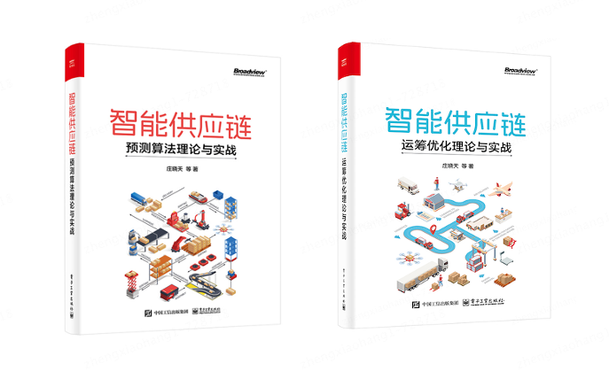

# 智能供应链系列丛书-案例代码库

欢迎来到《智能供应链》系列丛书的官方代码仓库。本系列丛书是智能供应链系统建设可参考的书籍之一，旨在为读者提供智能供应链建设中预测、运筹等算法的理论基础和实践应用。



**请注意：该代码库目前正在持续更新中。**

## 书籍简介

**《智能供应链-预测算法理论与实战》**

本书主要介绍人工智能和供应链行业融合中通用化和实战化的预测算法，以及这些预测算法在业界实际应用的案例，旨在通过简单易懂的方式让读者了解供应链相关的应用场景。本书作者具有丰富的业界经验，在供应链预测算法方面拥有丰富的理论研究和项目经验，能够将基础模型、进阶模型和行业实践有机地融合，循序渐进地介绍供应链预测算法，使读者在学习过程中感到轻松、有趣，并能应用所学知识。
本书涵盖了智能供应链预测领域的算法理论模型和行业实践知识。本书首先从商品需求预测案例开始介绍预测的基本流程，然后深入讨论基础预测模型和复杂预测模型策略，最后通过多个不同行业的预测实践案例来说明算法的应用场景。预测算法包括传统的时间序列、统计学习模型和机器学习、深度学习模型，通过不同类型算法的有效融合，为不同的应用场景提供坚实的算法基础。

**《智能供应链-运筹优化理论与实战》**

本书的特色是理论知识与行业实践案例结合，系统介绍了运筹算法，通过实践案例介绍如何运用运筹优化算法解决供应链管理问题，并详细阐述了案例问题的产生背景、建模过程、算法设计、求解代码。本书案例按照供应链规划、计划和执行三个维度组织，我们为读者准备了一条学习路线图，让读者能全面系统的了解智能供应链的不同阶段。规划篇从点到线再到面，逐步讲述了供应链网络的设计过程；计划篇以商品为对象，按照其从入库、在库到出库的不同存在形式，分别描述了品类规划、库存管理、包裹计划；执行篇则聚焦于供应链组成要素的日常运营过程，讲述了人、货、车、场四个要素在实操过程中遇到的调度问题。每个案例都详细描述了业务背景及建模过程，并附带具体的实现代码，读者可以在实操中加深对算法理论的理解，提升应用运筹算法解决供应链实际问题的能力。

## 书籍与代码的关系

本代码仓库旨在为读者提供与书中章节相对应的代码实例和模拟数据集。通过实际操作这些代码，读者可以更加深入地理解书中介绍的预测算法，并在自己的供应链问题上进行实验和应用。

## 如何使用此代码仓库

1. **克隆仓库**：首先，您需要克隆或下载此代码仓库到您的本地计算机。

   ```
   git clone https://github.com/XiaotianZhuang/smart-supply-chain-management-Demand-forecasting-algorithm-theory-and-practice.git
   ```

2. **安装依赖**：根据代码中的`requirements.txt`文件安装必要的Python库。

   请使用Python3.8及以上的环境进行。

   ```
   pip install -r requirements.txt
   ```

3. **阅读代码**：参照书中的章节内容，阅读对应的代码文件。

4. **运行和测试**：在您的本地环境中运行代码，观察和分析输出结果。

5. **修改和实验**：根据您的需求修改代码，并在您的数据集上进行实验。

## 贡献指南

我们欢迎并感谢社区成员的任何贡献。如果您有改进代码的建议或者想要添加新的示例，请遵循以下步骤：

1. Fork 仓库并创建您的分支。
2. 如果您添加了新的功能，请编写相应的测试。
3. 确保您的代码符合现有的代码风格。
4. 提交 Pull Request。

## 许可证

本代码仓库中的代码采用 [MIT 许可证](LICENSE)。在使用代码时，请确保遵循许可证的条款。

## 联系方式

如果您有任何问题或建议，请通过以下方式与我们联系：

- 作者：庄晓天
- 邮箱：xiaotian.zhuang@gmail.com
- 项目主页：https://github.com/XiaotianZhuang/smart-supply-chain-management-Demand-forecasting-algorithm-theory-and-practice

感谢您对《智能供应链》系列丛书的支持！
